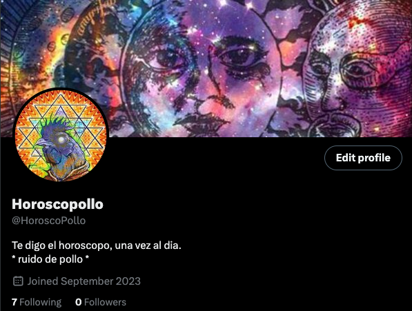

# Zodiak

This is an automated bot for X that scraps horoscopes in a web and translates them to spanish and then posts them.

The job is run daily at 10:00 am UTC and each post has a 15 minute delay between them to avoid too many requests and data in a row.

[Link to bot](https://twitter.com/HoroscoPollo)



# Want to clone/fork?

You can check the .env.template and see what exactly you need for this.

These are the API KEYS needed if you want to do the exact same. I won't specify how to set up the twitter dev account, please refer to [their docs here](https://developer.twitter.com/en/docs/twitter-api).
```
DEEPL_API_KEY=__DEEPL_API_KEY__

SCRAP_WEB=__SCRAP_WEB__
SCRAP_CLASS=__SCRAP_CLASS__

X_API_KEY=__X_API_KEY__
X_API_KEY_SECRET=__X_API_KEY_SECRET__

X_ACCESS_TOKEN=__X_ACCESS_TOKEN__
X_ACCESS_TOKEN_SECRET=__X_ACCESS_TOKEN_SECRET__

X_BEARER_TOKEN=__X_BEARER_TOKEN__

```

## SCRAP_WEB

This is essentially where do you want to get the data from. You set a web, and the code downloads and parses it as HTML.

## SCRAP_CLASS

Take a look into the lines in `scrapper.go`

> 	class := config.GetEnvVar("SCRAP_CLASS")
>
>	divs := doc.Find(class)
>
>	secondParagraph := divs.First().Find("p").Last().Text()

Basically, for my use case, it gets the `<div className=".class-here">` and takes the last `<p>`, which I base as the text for the bot.

Then, it just plays with the translation and such.

> Notes:
>
> If using this, take care of the deepl api url.

As I'm using the free tier, the url is "https://api-free.deepl.com/v2", but if you opt for another plan, change that.

Also, if you want to change the translator provider, goo into the `deepl.go` file and focus in the `translate` function, since it's the one doing the work.